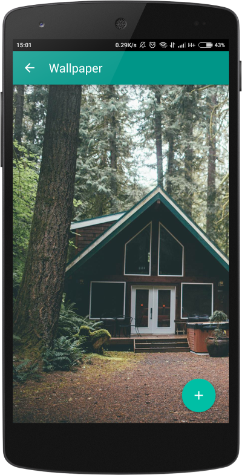

Fetch wallpapers from Reddit and display in an interative app with options to:

* Set, share wallpaper and save as favorite

Liraries/ORM used:

* [Butter Knife](https://github.com/JakeWharton/butterknife)

* [Sugar ORM](https://github.com/satyan/sugar)

* [OkHttp](https://github.com/square/okhttp)

* [Picasso](https://github.com/square/picasso)

* [Materialish Progress](https://github.com/pnikosis/materialish-progress)

* [Subsampling Scale Image View](https://github.com/davemorrissey/subsampling-scale-image-view)

* [Fab Toolbar](https://github.com/AlexKolpa/fab-toolbar)